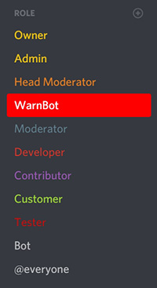

 

## WarnBot
System for warning, kicking and banning users.

## How To
1. [Invite the bot](https://discordapp.com/oauth2/authorize?client_id=355763643964719106&scope=bot&permissions=11238)
1. Go to *Server settings* => *Roles* => Move *WarnBot* role **ABOVE** the roles you want to be kicked/banned

> WarnBot can kick/ban anyone below, but cannot kick/ban anyone above.
1. Add *Admins* by using `/addusr` command 
Write `/help addusr` for more info

## Self Hosting
For self hosting WarnBot, you will need to have SQL installed and tables created using [this script](scheme.sql).

Then, you need to fill credentials in *DBConnector.cs*.

Create `token.exe` in build folder and paste the bot's token.

If you have any question (excluding errors - open new issue for that), you can join [my Discord](https://discord.gg/8DmPSFJ) for help.
